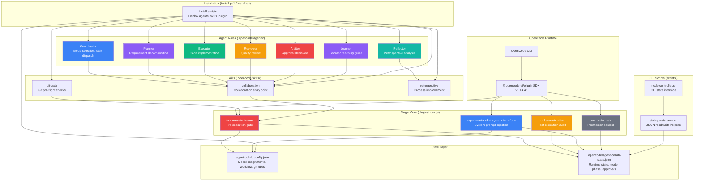
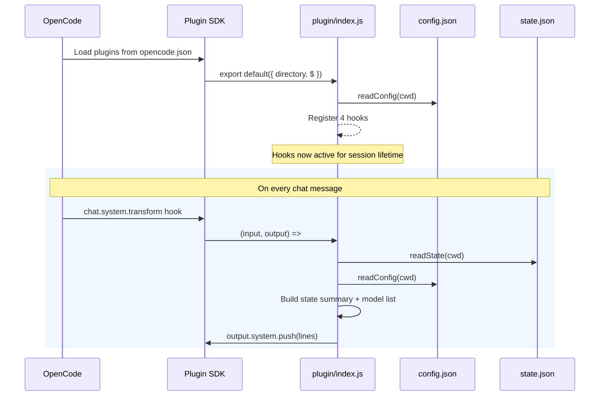
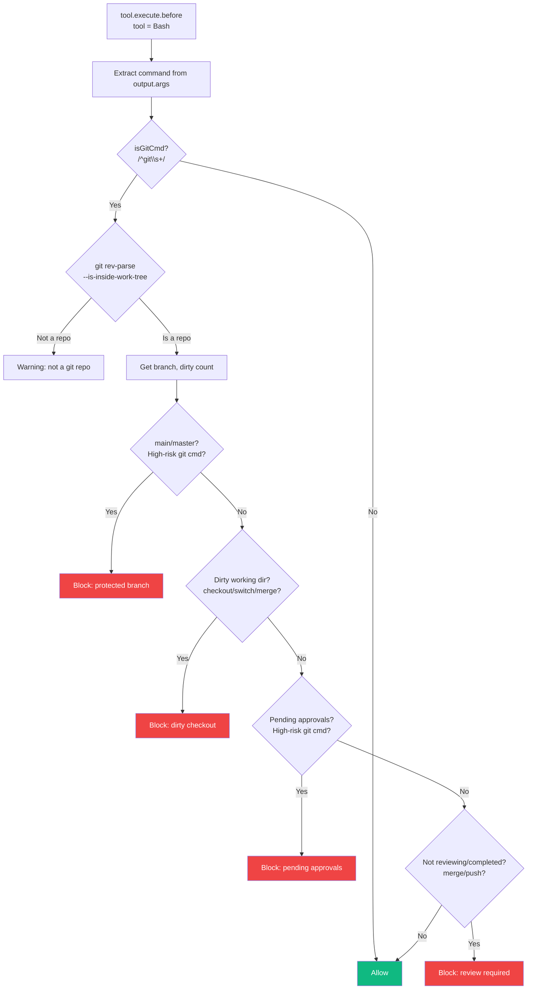
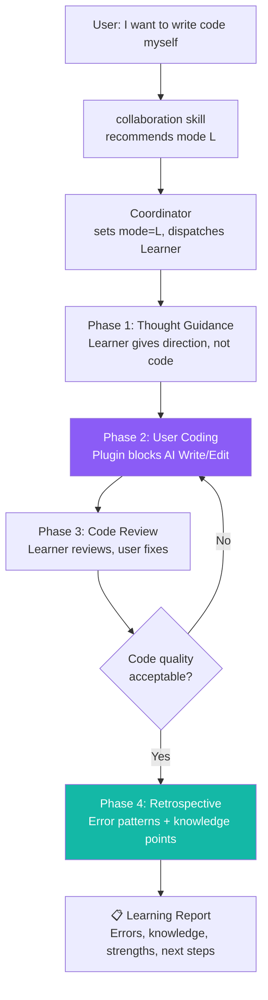
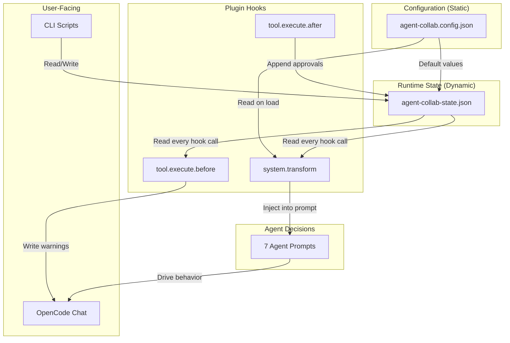

# agent-collab Architecture

> Auto-generated architecture documentation for the agent-collab OpenCode plugin.

---

## 1. Overview

**agent-collab** is a native OpenCode plugin that adds multi-agent collaboration with approval gating and Git protection to any OpenCode workspace. It provides:

- **7 specialized agents** (coordinator, planner, executor, reviewer, arbiter, reflector, learner) with Chinese-language prompts
- **4 collaboration modes** (A/B/C/L) controlling how agents interact and when approvals are required
- **4 OpenCode SDK hooks** that intercept tool calls in real-time to enforce rules
- **Git branch protection** preventing dangerous operations on protected branches
- **State machine** persisted to JSON, tracking mode/phase/approvals across sessions

### Codebase Stats

| Metric | Value |
|--------|-------|
| Source files | 17 (excl. docs/git) |
| Core plugin | 295 lines (`plugin/index.js`) |
| Agent prompts | 7 files (coordinator, planner, executor, reviewer, arbiter, reflector, learner) |
| Skills | 3 (collaboration, git-gate, retrospective) |
| CLI scripts | 2 Bash scripts (state-persistence, mode-controller) |
| Install scripts | 2 (PowerShell + Bash) |
| Documentation | 4 docs + README + engineering spec |
| Language | JavaScript (ESM), Bash, PowerShell, Markdown |

---

## 2. Architecture Diagram



---

## 3. Functional Areas

### 3.1 Plugin Hook System

**File:** `plugin/index.js` (295 lines)

The plugin registers 4 hooks with the OpenCode SDK (`@opencode-ai/plugin@1.14.41`):

| Hook | Trigger | Purpose |
|------|---------|---------|
| `tool.execute.before` | Before Write/Edit/Bash runs | Mode gates, approval checks, Git protection |
| `tool.execute.after` | After Write/Edit completes | Audit trail for mode C (auto-creates approval items) |
| `experimental.chat.system.transform` | On every chat message | Injects collaboration state + model recommendations into system prompt |
| `permission.ask` | When OpenCode asks user permission | Attaches collaboration context to permission requests |

**Interception mechanism:** The SDK does not support direct blocking. The plugin injects `_agentCollabWarning` into `output.args` to signal that an operation should not proceed, relying on the agent to respect the warning.

### 3.2 Agent Role System

**Directory:** `.opencode/agents/` (7 files)

Each agent is a Markdown file with YAML frontmatter (description, color) and a structured prompt defining responsibilities, mode adaptations, boundaries, and output format.

| Agent | Color | Responsibility | Model |
|-------|-------|---------------|-------|
| **Coordinator** | Blue `#3B82F6` | Mode selection, task dispatch, conflict resolution, approval gating | `glm-5.1` |
| **Planner** | Purple `#8B5CF6` | Requirement decomposition, risk identification, execution planning | `qwen3.6-plus` |
| **Executor** | Green `#10B981` | Implementation per confirmed plan, minimal changes, self-test | `glm-5.1` |
| **Reviewer** | Amber `#F59E0B` | Code quality review, boundary checks, consistency audit | `glm-5-turbo` |
| **Arbiter** | Red `#EF4444` | Approval decisions (auto/manual/hybrid), risk-based gating | `glm-4.7` |
| **Reflector** | Teal `#14B8A6` | Retrospective analysis, experience extraction, rule creation | `kimi-k2.6` |
| **Learner** | Purple `#8B5CF6` | Socratic teaching, code review feedback, error retrospective | `glm-5.1` |

**Key design principle:** Strict separation of concerns — reviewers never write code, coordinators never make quality judgments, arbiters never make technical judgments.

### 3.3 State Machine

**File:** `.opencode/agent-collab-state.json`

The runtime state is a JSON file with the following fields:

```
State = {
  enabled: boolean,
  mode: "A" | "B" | "C" | "L",
  phase: "planning" | "executing" | "reviewing" | "completed",
  approval_policy: "auto" | "manual" | "hybrid",
  pending_approvals: Array<{desc, status, ts}>,
  completed_tasks: Array<...>,
  active_agents: Array<...>,
  git_main_branch_protection: boolean,
  git_require_clean_checkout: boolean,
  git_block_on_pending_approvals: boolean,
  git_require_review_before_merge: boolean,
}
```

**State transitions are governed by mode rules:**

| Mode | Valid phase flow | Approval behavior |
|------|-----------------|-------------------|
| A | planning → executing → reviewing → completed | Block if pending approvals during planning |
| B | starts at executing → reviewing → completed | Minimal approval gating |
| C | planning → executing → reviewing → completed (each gated) | Block all transitions with pending approvals |
| L | custom (learner-driven) | Block AI from Write/Edit entirely |

### 3.4 Git Protection

**Implemented in:** `plugin/index.js` (Bash hook, lines 169-239)

Four independent protection rules, each checking real Git state via `$` shell commands:

1. **Main branch protection** — Blocks `commit/push/merge/rebase/reset/cherry-pick` on `main`/`master`
2. **Dirty checkout protection** — Blocks `checkout/switch/merge/rebase/pull` when working directory has uncommitted changes
3. **Approval blocking** — Blocks high-risk Git commands when `pending_approvals.length > 0`
4. **Review-before-merge** — Blocks `merge/push` unless phase is `reviewing` or `completed`

### 3.5 CLI Interface

**Files:** `scripts/mode-controller.sh` (136 lines), `scripts/state-persistence.sh` (304 lines)

A Bash CLI providing manual state management outside of OpenCode sessions:

| Command | Function |
|---------|----------|
| `mode-controller.sh status` | Display current mode/phase/policy + Git status |
| `mode-controller.sh init` | Initialize state file with defaults |
| `mode-controller.sh mode <A\|B\|C>` | Switch collaboration mode |
| `mode-controller.sh phase <name>` | Transition phase (with gate checks) |
| `mode-controller.sh policy <auto\|manual\|hybrid>` | Change approval policy |
| `mode-controller.sh approve/reject` | Resolve pending approval items |
| `mode-controller.sh request <desc>` | Add new approval request |
| `mode-controller.sh validate` | Validate state file integrity |
| `mode-controller.sh git-check` | Display Git protection status |

`state-persistence.sh` provides low-level JSON read/write helpers using Node.js (with sed fallback for reading). It also includes **migration logic** from the legacy `.claude/agent-collab.local.md` YAML format.

### 3.6 Skill System

**Directory:** `.opencode/skills/` (3 files)

Skills are trigger-based entry points that OpenCode loads based on user intent matching:

| Skill | Trigger Phrases | Purpose |
|-------|----------------|---------|
| **collaboration** | "start collaboration", "help me break down tasks", "I want to write code myself" | Unified entry for mode selection, task decomposition, approval gating |
| **git-gate** | "commit code", "push", "merge branches", "pre-merge check" | Unified Git pre-flight checks |
| **retrospective** | "retrospective", "summarize", "what can be improved" | Post-collaboration process analysis |

### 3.7 Installation System

**Files:** `install.ps1` (PowerShell, 60 lines), `install.sh` (Bash, 66 lines)

Both scripts perform the same operations:

1. Create `.opencode/{agents,skills,plugins/agent-collab}/` directories
2. Copy agent prompts, skills, and plugin files to target project
3. Copy `agent-collab.config.json` to `.opencode/`
4. **Auto-generate or merge** `.opencode/opencode.json` to register the plugin entry `"./plugins/agent-collab"`

Supports three installation modes: project-local (default), global (manual copy to `~/.config/opencode/`), or in-repo (the agent-collab repo itself is OpenCode-compatible).

---

## 4. Key Execution Flows

### 4.1 Plugin Initialization



### 4.2 Write/Edit Gate (Pre-execution)

This is the primary enforcement mechanism. Every Write or Edit tool call passes through this gate.

```mermaid
flowchart TD
    START["tool.execute.before<br/>tool = Write | Edit"] --> CHECK_ENABLED{state.enabled?}
    CHECK_ENABLED -->|No| PASS["Allow (no interception)"]
    CHECK_ENABLED -->|Yes| CHECK_MODE{mode?}

    CHECK_MODE -->|L| BLOCK_L["Inject _agentCollabWarning<br/>Learning mode: AI should not write code"]
    CHECK_MODE -->|A| CHECK_PHASE_A{phase = planning?<br/>pending > 0?}
    CHECK_MODE -->|B| PASS
    CHECK_MODE -->|C| CHECK_POLICY{policy = manual?<br/>OR (hybrid AND pending > 0)?}

    CHECK_PHASE_A -->|Yes| BLOCK_A["Inject _agentCollabWarning<br/>Pending approvals in planning phase"]
    CHECK_PHASE_A -->|No| PASS

    CHECK_POLICY -->|Yes| BLOCK_C["Inject _agentCollabWarning<br/>Pending approvals, mode C"]
    CHECK_POLICY -->|No| PASS

    BLOCK_L --> END["Return"]
    BLOCK_A --> END
    BLOCK_C --> END
    PASS --> END

    style BLOCK_L fill:#8B5CF6,color:#fff
    style BLOCK_A fill:#3B82F6,color:#fff
    style BLOCK_C fill:#EF4444,color:#fff
    style PASS fill:#10B981,color:#fff
```

### 4.3 Git Protection Flow

Every Bash tool call is inspected for Git commands and run through 4 independent protection checks.



### 4.4 Full Collaboration Lifecycle (Mode A)

```mermaid
flowchart LR
    subgraph "1. Initiation"
        U1["User: start collaboration"] --> S1["collaboration skill"]
        S1 --> C1["Coordinator<br/>Select mode A"]
    end

    subgraph "2. Planning"
        C1 --> C2["Planner<br/>Decompose tasks"]
        C2 --> C3["User confirms plan"]
    end

    subgraph "3. Execution"
        C3 --> E1["Executor<br/>Implement changes"]
        E1 --> E2["Plugin gate allows<br/>phase=executing"]
    end

    subgraph "4. Review"
        E2 --> R1["Reviewer<br/>Quality review"]
        R1 --> R2{Passed?}
        R2 -->|No| E1
        R2 -->|Yes| A1["Arbiter<br/>Approval decision"]
    end

    subgraph "5. Merge"
        A1 --> G1["git-gate skill<br/>Pre-flight checks"]
        G1 --> G2["Git merge/push"]
    end

    subgraph "6. Retrospective"
        G2 --> RET["Reflector<br/>Process analysis"]
        RET --> DONE["Completed"]
    end
```



### 4.5 Learning Mode (Mode L) Flow



---

## 5. Data Flow



---

## 6. Directory Structure

```
agent-collab/
├── plugin/
│   ├── index.js              # Plugin core — 4 SDK hooks, state management, gate logic
│   └── package.json          # ESM module definition
├── scripts/
│   ├── mode-controller.sh    # CLI: mode/phase/policy switching, Git checks
│   └── state-persistence.sh  # JSON read/write helpers, migration from legacy YAML
├── .opencode/
│   ├── agents/
│   │   ├── coordinator.md    # Mode selection, task dispatch
│   │   ├── planner.md        # Requirement decomposition
│   │   ├── executor.md       # Code implementation
│   │   ├── reviewer.md       # Quality review
│   │   ├── arbiter.md        # Approval decisions
│   │   ├── reflector.md      # Retrospective analysis
│   │   └── learner.md        # Socratic teaching + error retrospective
│   └── skills/
│       ├── collaboration/
│       │   └── SKILL.md      # Unified collaboration entry point
│       ├── git-gate/
│       │   └── SKILL.md      # Git pre-flight check entry point
│       └── retrospective/
│           └── SKILL.md      # Process improvement entry point
├── docs/
│   ├── engineering-spec.md   # Total engineering specification
│   ├── workflow-v2.md        # Simplified workflow design
│   ├── git-workflow.md       # Git rules and conventions
│   ├── coordination-plan.md  # Original coordination design
│   └── install-usage.md      # Installation and usage guide
├── agent-collab.config.json  # Agent models, workflow defaults, Git rules
├── install.ps1               # Windows installer (PowerShell)
├── install.sh                # Unix installer (Bash)
├── README.md                 # Project overview
├── CHANGELOG.md              # Version history
├── RELEASE_NOTES.md          # Release notes
└── LICENSE                   # License file
```

---

## 7. Design Decisions

| Decision | Rationale |
|----------|-----------|
| **Warning injection over hard block** | OpenCode SDK v1.14.41 has no direct blocking mechanism; `_agentCollabWarning` in `output.args` is the best available approach |
| **JSON state over YAML** | Better programmatic access from both JS and Bash; migration path from legacy `.claude/` YAML format included |
| **4 independent Git checks** | Each check is a separate concern (branch protection, dirty state, approvals, review status) — can be independently enabled/disabled via config |
| **Mode-specific agent behavior** | Each agent prompt includes a "mode adaptation" section defining how behavior changes per mode, keeping the same agent definition flexible |
| **Config-driven model selection** | Agent model recommendations are injected via system prompt rather than hardcoded, allowing per-project customization |
| **Socratic method for learner** | Progressive hint reduction (direction → API → keyword) maximizes learning while preventing AI from writing code directly |
| **Cross-platform install** | PowerShell for Windows, Bash for Unix, with identical logic ensuring consistent deployment |
